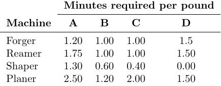
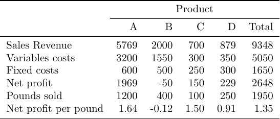

# Introduction

The **Manifacturing INC** (MNC) makes four different metal alloys: A, B, C and D.
The company is barely able to keep up with the increasing demand for these products. However, increasing raw material prices and foreign competition are forcing MNC to watch its margins to ensure it is operating in the most efficient manner possible.

# Marketing Demands

To meet marketing demands for the coming week, MNC needs to produce

- at least 1,200 pounds of the A product,
- between 450 and 650 pounds of the B product,
- no more than 120 pounds of the C product, and
- no more than 150 pounds of D product.

# Production Requirements

Each pound of the A, B, C, and D product contains, respectively, 55%, 45%, 25%, and 100% aluminum made up of copper.

The company has 1300 pounds of aluminum and 900 pounds of copper copper for use in the next week.

The various products are made using four different machines: forger, reamer, shaper, and planer. The following table summarizes the time required by each product on each machine. Each machine has 60 hours of time available in the coming week.

# Financial summary

The controller recently presented management with the following financial summary of MNC's average weekly operations over the past quarter. From this report, the controller is arguing that the company should cease producing its B and C products.

# Questions
a. Do you agree with the controller's recommendation? Why or why not?
b. Formulate an LP model for this problem.
c. Create a executable model in R for this problem and solve it.
d. What is the optimal solution?
e. Perform the sensitivity analysis for this solution and answer the following questions.
f. Is the solution degenerate?
g. Is the solution unique?
h. If MNC wanted to decrease the production on any product, which one would you recommend and why?
i. If MNC wanted to increase the production of any product, which one would you recommend and why?
j. Which resources are preventing MNS from making more money? If they could acquire more of this resource how much should they acquire & how much should they be willing to pay to acquire it?
k. How much should MNC be willing to pay to acquire more copper?
l. If the marketing department wanted to decrease the price of the A product by $0.25, would the optimal solution change?