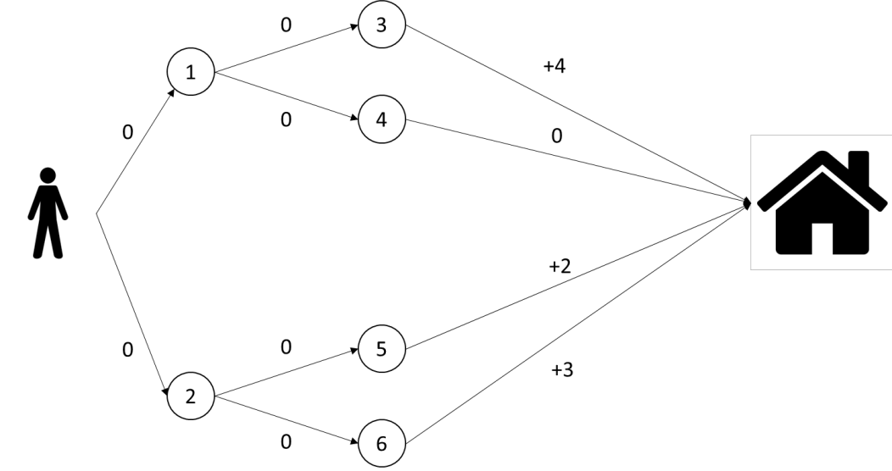

```{r setup, include=FALSE}
knitr::opts_chunk$set(echo = TRUE)
knitr::opts_chunk$set(fig.align = 'center')
```

# Solution of the problem

The objective of the assignment is to maximize the reward in following condition:

```{r inital path, echo=FALSE, fig.cap="Representation of the problem",fig.pos='h'}

```


The initial polict $\pi_0$ is:

- $0 \to 2$

- $2 \to 5$

- $1 \to 4$

The state function of the nodes $3,4,5,6$, which remains costant will be not be calculated or written.

\begin{figure}[!h]
\centering
\begin{tikzpicture}[->,>=stealth',shorten >=1pt,auto,node distance=2.8cm,
                    semithick]
  \tikzstyle{every state}=[fill=white,text=black]
  \tikzset{final/.style={draw,circle,fill=black,text=white},
  start/.style={draw,circle,fill=red,text=white},
  policy_right/.style={ultra thick, draw=blue,bend right},
  policy_left/.style={ultra thick, draw=blue,bend left}}

  \node[initial,start] (0)                                  {$0$};
  \node[state]         (1) [yshift=-0.5cm,above right=of 0] {$1$};
  \node[state]         (2) [yshift=+0.5cm,below right=of 0] {$2$};
  \node[state]         (3) [yshift=-1.0cm,above right=of 1] {$3$};
  \node[state]         (4) [yshift=+1.5cm,below right=of 1] {$4$};
  \node[state]         (5) [yshift=-1.5cm,above right=of 2] {$5$};
  \node[state]         (6) [yshift=+1.0cm,below right=of 2] {$6$};
  \node[final]         (H) [xshift=+5.5cm,right=of 0]        {H};

  \path (0) edge                node {0} (1)
            edge                node {0} (2)
            edge [policy_right] node {}  (2)
        (1) edge                node {0} (3)
            edge                node {0} (4)
            edge [policy_right] node {}  (4)
        (2) edge                node {0} (5)
            edge                node {0} (6)
            edge [policy_left]  node {}  (5)
        (3) edge [ultra thick, draw=blue]  node {4} (H)
        (4) edge [ultra thick, draw=blue]  node {0} (H)
        (5) edge [ultra thick, draw=blue]  node {2} (H)
        (6) edge [ultra thick, draw=blue]  node {3} (H);
\end{tikzpicture}
\caption{Inital Policy $\pi_0$ Representation}
\end{figure}


The state function for the initial policy is:

\begin{align*}
V^{\pi_0}(0)&=max\{0+\gamma \cdot 0, 0 + \gamma \cdot 2 \} = 2\\
V^{\pi_0}(1)&=max\{0 + \gamma \cdot 4 , 0 + \gamma \cdot 0 \} = 4\\
V^{\pi_0}(2)&=max\{0 + \gamma \cdot 2 , 0 + \gamma \cdot 3 \} = 3
\end{align*}

where the first argument indicates the path to the left and the second argument indicates the path to the right. $\gamma$, the discount factor, has been decided to be $=1$.

\pagebreak

## Policy $\pi_1$

The new policy $\pi_1$ now is:

- $0 \to 2$

- $2 \to 6$

- $1 \to 3$

\begin{figure}[!h]
\centering
\begin{tikzpicture}[->,>=stealth',shorten >=1pt,auto,node distance=2.8cm,
                    semithick]
  \tikzstyle{every state}=[fill=white,text=black]
  \tikzset{final/.style={draw,circle,fill=black,text=white},
  start/.style={draw,circle,fill=red,text=white},
  policy_right/.style={ultra thick, draw=blue,bend right},
  policy_left/.style={ultra thick, draw=blue,bend left}}

  \node[initial,start] (0)                                  {$0$};
  \node[state]         (1) [yshift=-0.5cm,above right=of 0] {$1$};
  \node[state]         (2) [yshift=+0.5cm,below right=of 0] {$2$};
  \node[state]         (3) [yshift=-1.0cm,above right=of 1] {$3$};
  \node[state]         (4) [yshift=+1.5cm,below right=of 1] {$4$};
  \node[state]         (5) [yshift=-1.5cm,above right=of 2] {$5$};
  \node[state]         (6) [yshift=+1.0cm,below right=of 2] {$6$};
  \node[final]         (H) [xshift=+5.5cm,right=of 0]        {H};

  \path (0) edge                node {0} (1)
            edge                node {0} (2)
            edge [policy_right] node {}  (2)
        (1) edge                node {0} (3)
            edge                node {0} (4)
            edge [policy_left]  node {}  (3)
        (2) edge                node {0} (5)
            edge                node {0} (6)
            edge [policy_right] node {}  (6)
        (3) edge [ultra thick, draw=blue]  node {4} (H)
        (4) edge [ultra thick, draw=blue]  node {0} (H)
        (5) edge [ultra thick, draw=blue]  node {2} (H)
        (6) edge [ultra thick, draw=blue]  node {3} (H);
\end{tikzpicture}
\caption{Policy $\pi_1$ Representation}
\end{figure}


The state function in $\pi_1$ is:

\begin{align*}
V^{\pi_1}(0)&=max\{0+\gamma \cdot 4, 0 + \gamma \cdot 3 \} = 4\\
V^{\pi_1}(1)&=max\{0 + \gamma \cdot 4 , 0 + \gamma \cdot 0 \} = 4\\
V^{\pi_1}(2)&=max\{0 + \gamma \cdot 2 , 0 + \gamma \cdot 3 \} = 3
\end{align*}


## Policy $\pi_2$

The new policy derived from the state function is $\pi_2$:

- $0 \to 1$

- $2 \to 6$

- $1 \to 3$

Actually this is the best path, but to confirm the convergence the next step is needed.

It can be verified immediatly that the state function does not change and that $\pi_3 = \pi_2$, which is the condition for the convergence.


\begin{figure}[!h]
\centering
\begin{tikzpicture}[->,>=stealth',shorten >=1pt,auto,node distance=2.8cm,
                    semithick]
  \tikzstyle{every state}=[fill=white,text=black]
  \tikzset{final/.style={draw,circle,fill=black,text=white},
  start/.style={draw,circle,fill=red,text=white},
  policy_right/.style={ultra thick, draw=blue,bend right},
  policy_left/.style={ultra thick, draw=blue,bend left}}

  \node[initial,start] (0)                                  {$0$};
  \node[state]         (1) [yshift=-0.5cm,above right=of 0] {$1$};
  \node[state]         (2) [yshift=+0.5cm,below right=of 0] {$2$};
  \node[state]         (3) [yshift=-1.0cm,above right=of 1] {$3$};
  \node[state]         (4) [yshift=+1.5cm,below right=of 1] {$4$};
  \node[state]         (5) [yshift=-1.5cm,above right=of 2] {$5$};
  \node[state]         (6) [yshift=+1.0cm,below right=of 2] {$6$};
  \node[final]         (H) [xshift=+5.5cm,right=of 0]        {H};

  \path (0) edge                node {0} (1)
            edge                node {0} (2)
            edge [policy_left]  node {}  (1)
        (1) edge                node {0} (3)
            edge                node {0} (4)
            edge [policy_left]  node {}  (3)
        (2) edge                node {0} (5)
            edge                node {0} (6)
            edge [policy_right] node {}  (6)
        (3) edge [ultra thick, draw=blue]  node {4} (H)
        (4) edge [ultra thick, draw=blue]  node {0} (H)
        (5) edge [ultra thick, draw=blue]  node {2} (H)
        (6) edge [ultra thick, draw=blue]  node {3} (H);
\end{tikzpicture}
\caption{Policy $\pi_2=\pi_3$ Representation}
\end{figure}


\begin{figure}[!h]
\centering
\begin{tikzpicture}[->,>=stealth',shorten >=1pt,auto,node distance=2.8cm,
                    semithick]
  \tikzstyle{every state}=[fill=white,text=black]
  \tikzset{final/.style={draw,circle,fill=black,text=white},
  start/.style={draw,circle,fill=red,text=white},
  policy_right/.style={ultra thick, draw=blue,bend right},
  policy_left/.style={ultra thick, draw=blue,bend left}}

  \node[initial,start] (0)                                  {$0$};
  \node[state]         (1) [yshift=-0.5cm,above right=of 0] {$1$};
  \node[state]         (2) [yshift=+0.5cm,below right=of 0] {$2$};
  \node[state]         (3) [yshift=-1.0cm,above right=of 1] {$3$};
  \node[state]         (4) [yshift=+1.5cm,below right=of 1] {$4$};
  \node[state]         (5) [yshift=-1.5cm,above right=of 2] {$5$};
  \node[state]         (6) [yshift=+1.0cm,below right=of 2] {$6$};
  \node[final]         (H) [xshift=+5.5cm,right=of 0]        {H};

  \path (0) edge                node {0} (1)
            edge                node {0} (2)
            edge [ultra thick, draw=blue]  node {}  (1)
        (1) edge                node {0} (3)
            edge                node {0} (4)
            edge [ultra thick, draw=blue]  node {}  (3)
        (2) edge                node {0} (5)
            edge                node {0} (6)
        (3) edge [ultra thick, draw=blue]  node {4} (H)
        (4) edge                node {0} (H)
        (5) edge                node {2} (H)
        (6) edge                node {3} (H);
\end{tikzpicture}
\caption{Final Solution Representation}
\end{figure}
